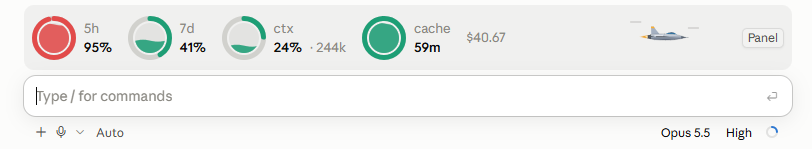
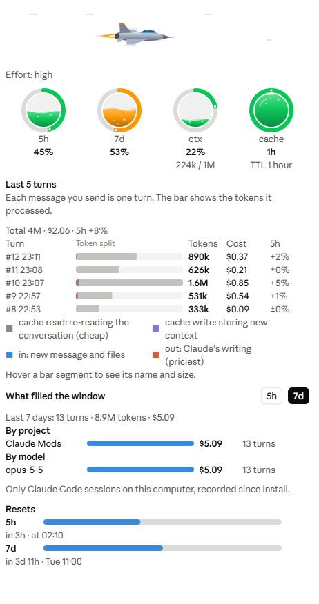
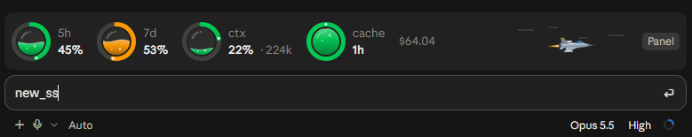
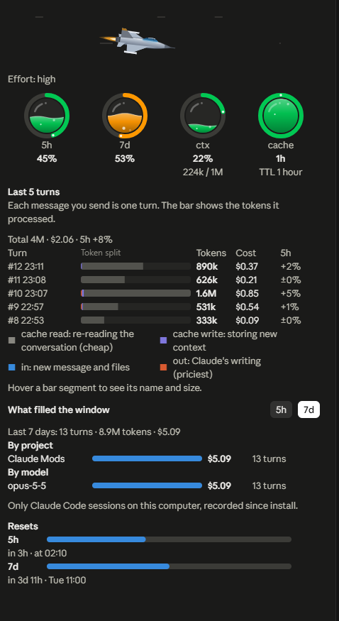

# wavy-usage

Liquid-filled rings above the Claude Code prompt: your 5-hour and 7-day limit windows, how full the context is, and how long the prompt cache stays warm. A small fighter jet shows the model's effort: the lower the effort, the faster it flies. A side pane shows your last turns, what each one cost, and which projects and models filled the window.

Zero tokens: everything is read from what Claude Code already knows. No network, no model calls.






## What you get

**The band** (above the prompt, Claude Code desktop)

| Ring | Shows |
| --- | --- |
| `5h` | Share of the 5-hour limit window used |
| `7d` | Share of the 7-day limit window used |
| `ctx` | Context window fill, with the token count |
| `cache` | Time left before the prompt cache goes cold |

The liquid rises and falls with the value and keeps a gentle wave. Rings turn amber past 50% and red past 75%. The cache ring drains as the cache lifetime runs out, in 5-minute steps for the 1-hour lifetime, and turns amber in its last fifth. The rings hold still while Claude works and move when the prompt finishes, and the band redraws only when something on it changes. The session cost sits at the end of the band, and `Panel` opens the pane.

**The jet**: a small fighter jet flies just left of `Panel` and shows the model's effort. It banks right and left, then rolls through a corkscrew, with wind streaming past. Lower effort answers faster, so the jet flies faster: `low` races with a violet afterburner and shock diamonds, then `medium` (red), `high` (orange) and `xhigh` (amber), down to `max`, which cruises slowly with a small blue flame because it thinks longest. It hides on a narrow band, and the terminal shows `✈ low` and so on instead.

**The pane** (`Panel` or `/wavy-usage`)

- The jet, larger, with the effort level
- The four rings, larger
- **Last 5 turns**: a table with a total line and column headers. Each turn shows its number and time, a stacked bar of its tokens (hover a segment for its name and size), its token total, its cost and how much the 5-hour window grew during it. The legend says what each color means: cache reads are the cheap re-reading of the conversation, output is the priciest
- **What filled the window**: the 5-hour or 7-day window broken down by project and by model, ranked by cost
- **Resets**: when each window resets, with a progress bar

**In the terminal** the band is one colored line:

```
◔ 5h 34%  ○ 7d 12%  ◑ ctx 62% 124k  ◕ cache 47m  $1.23
```

The pane is drawn on desktop only. Both the band and the pane follow the app's light or dark theme.

When the context passes 55%, a toast suggests `/clear` for a new task or `/compact` to keep going, once per new tenth.

## Install

Requires Claude Code with mods (function hooks). On 2.1.287 and later they are on by default. On earlier builds with early access, set this first in `~/.claude/settings.json`:

```json
{ "env": { "CLAUDE_CODE_ENABLE_FUNCTION_HOOKS": "1" } }
```

Then, in a Claude Code session:

```
/plugin marketplace add BatuhanCakmakk/wavy-usage
/plugin install wavy-usage@wavy-usage
```

Or from your shell:

```bash
claude plugin marketplace add BatuhanCakmakk/wavy-usage
claude plugin install wavy-usage@wavy-usage
```

Or both at once inside a session (Claude Code 2.1.275 or later):

```
/plugin install wavy-usage --marketplace BatuhanCakmakk/wavy-usage
```

Start a new session and the band appears after the first reply.

To get a new release later, run `claude plugin update wavy-usage@wavy-usage`, or turn on auto-update for the marketplace in `/plugin`.

## Commands

| Command | Does |
| --- | --- |
| `/wavy-usage` | Opens or closes the pane |
| `/wavy-usage off` | Hides the band and the pane, and stops the toasts. Kept across sessions |
| `/wavy-usage on` | Turns it back on |
| `/wavy-usage ttl 5m` / `ttl 1h` | Sets the cache lifetime the countdown uses (default 1 hour, what Claude Code uses on a subscription) |

## Languages

English, Türkçe, Français, Deutsch, 日本語, 한국어, Português (Brasil) and Español. The languages after English and Turkish follow the countries with the largest share of Claude.ai use in the [Anthropic Economic Index](https://huggingface.co/datasets/Anthropic/EconomicIndex) (February 2026).

Pick one under **Language** in `/config`. With `auto` (the default), wavy-usage follows Claude Code's own `language` setting, then your system locale, then English.

Translations other than English and Turkish have not yet been reviewed by native speakers. Corrections are very welcome: every string lives in [`hooks/i18n.ts`](hooks/i18n.ts).

## How it works

- **Limit windows, context and cost** come from Claude Code's own `session.measure` event: the figures the last API response already reported. Nothing extra is requested.
- **Turn tokens** come from `turn.complete`. A turn's counts are the sum of all its requests, so cache reads grow with context size times the number of steps.
- **Turn cost** is the change in Claude Code's own session cost between turns, so it follows the real pricing, cache lifetimes and subagents.
- **Cache countdown** starts when a main-conversation turn ends. Subagent turns do not refresh it. It is an upper bound: the service can drop a cache entry early.

## Privacy and footprint

- No network access, no model calls, no files read or written outside the plugin store.
- The plugin store keeps: whether the band is on, the cache lifetime setting, the last effort level seen, and for each session a list of turns (time, project folder name, model, token total, cost). A session's list is deleted once its last turn is more than 8 days old.
- Everything stays on your computer.

Run `claude plugin validate` on the folder to see every event it hooks and every call it makes.

To switch it off without uninstalling, set `CLAUDE_MODS_DISABLE=wavy-usage` (or `all`) in the environment.

## Limitations

- Plan limits count all your usage: claude.ai, the apps and other computers. The rings show the true window fill, but **What filled the window** only knows the Claude Code sessions on this computer, since wavy-usage was installed.
- The cache countdown is an estimate (see above).
- The pane is desktop only. The terminal gets the one-line band.

## Development

```bash
claude plugin validate .
claude plugin test .
```

Tests run against the engine's own test kit and cover the pure logic (`hooks/model.ts`, `hooks/svg.ts`, `hooks/terminal.ts`, `hooks/i18n.ts`) and the hooks on both the desktop and the terminal surface.

## Credits

Inspired by [usage-band](https://github.com/yash-gadodia/claude-mods/tree/main/usage-band) by Yash Gadodia, and by [cache-ttl-timer](https://github.com/WQGGSEY/cache-ttl-timer) and [claude-runway](https://github.com/mtalhasahin/claude-runway).

## License

[MIT](LICENSE) © 2026 Batuhan Çakmak

## Dark theme

The band and the pane follow the app's dark theme.




